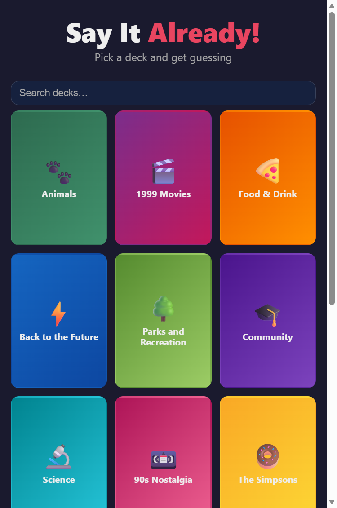
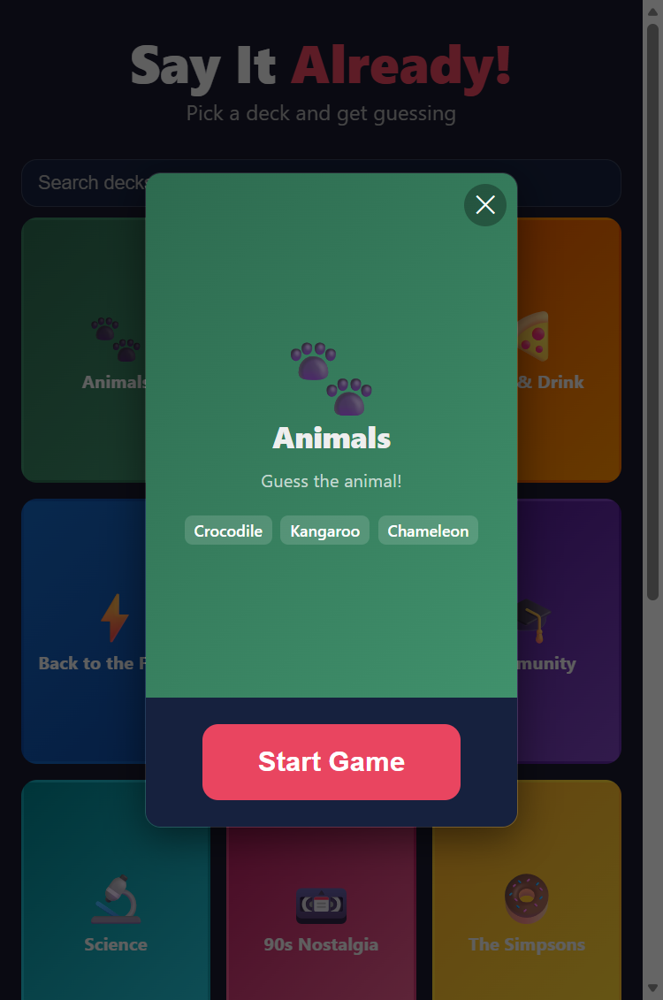

# Say It Already!

A Heads Up!–style party word game. Pick a deck, hold your phone up, and get your friends to help you guess the word!

**[Play now](https://david-risney.github.io/SayItAlready/)**

<p align="center">
  
  &nbsp;&nbsp;
  
</p>

## Features

- 24 built-in themed decks (movies, TV shows, games, food, and more)
- Gyro, swipe, or button controls
- Adjustable round timer
- Create and edit custom decks
- Share decks via QR code
- Installable PWA — works offline
- No accounts, no ads, no tracking

## How to Play

1. Pick a deck
2. Hold your phone on your forehead so others can see the word
3. Your friends describe the word without saying it
4. Tilt down (or swipe/tap) for correct, tilt up to skip
5. See your score when the timer runs out

## Running Locally

Serve the project root with any static HTTP server:

```sh
npx serve .
```

No build step required — it's vanilla HTML/CSS/JS with ES modules.

## License

[MIT](LICENSE)

## Privacy

See [PRIVACY.md](PRIVACY.md). TL;DR: everything stays on your device.
